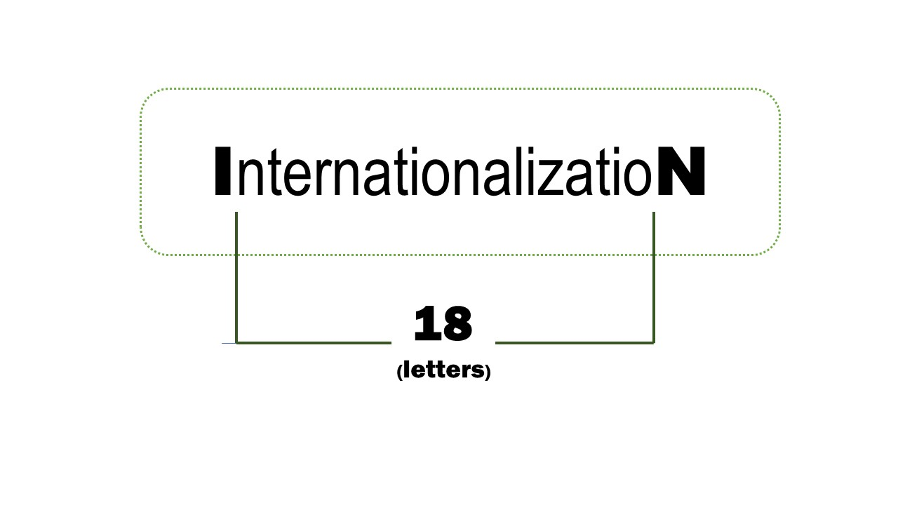
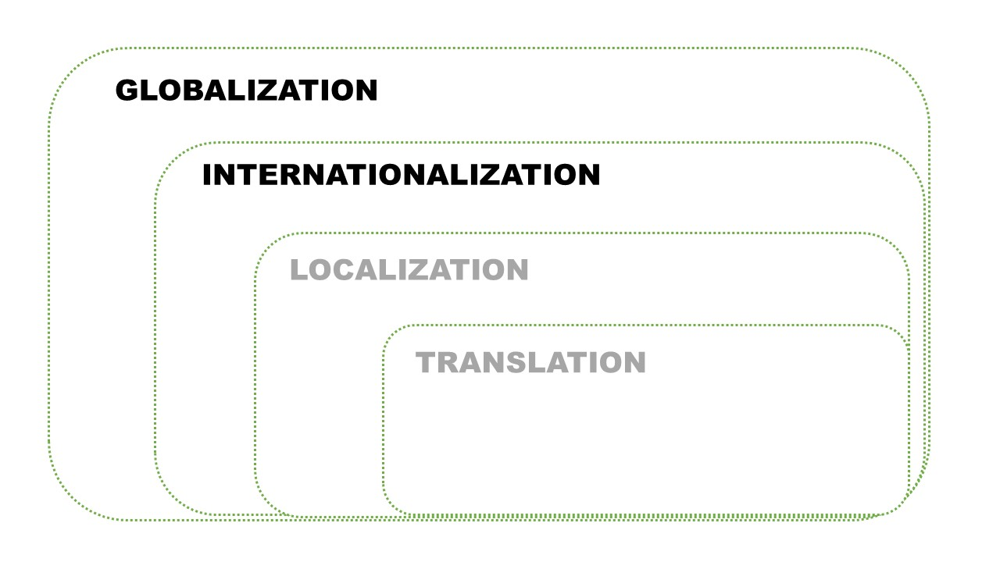

 

**Globalization (g11n)** is the strategic approach of expanding a business beyond national borders. Not only does it include internationalization, localization, and translation, it also affects every business aspect of product and service commercialization.

**Internationalization (i18n)** is the engineering effort to make a product — an app in our case — ready for localization, i.e. adaptation to different regions. It includes important simplifications in the source code needed to avoid individual changes when entering foreign markets.

 