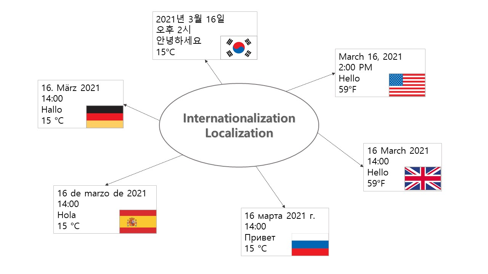

 

<h1>Overview</h1>

To reach out to the users in the global market,
it is essential to provide your apps and services in many different languages.
Making your apps and services ready for global distribution mainly consists of the following processes:

<h4>Internationalization (i18n)</h4>
Internationalization is the process of preparing your app’s content for localization so that it can be adapted to different languages and regions. 
<h4>Localization (l10n)</h4>
Localization is the process of adapting it to a specific language and locale.

