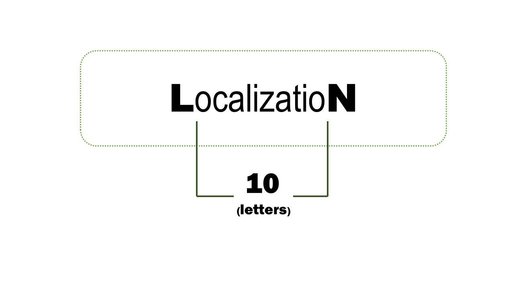
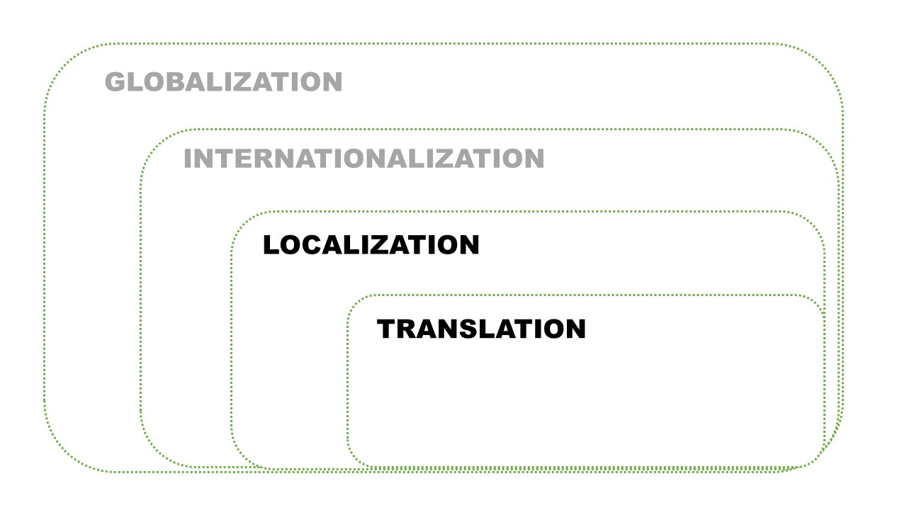

 

**Localization (l10n)** is where the actual app content comes in. It’s the process of adapting a product to the local context of a target market and takes its culture, history, legal framework, local time, lifestyle, customs, etc. into account.

**Translation (t9n)** implies converting the message from one language into another within the scope of the localization process. It aims to find words or expressions that can make the original meaning of the message sound native in the target language.

 